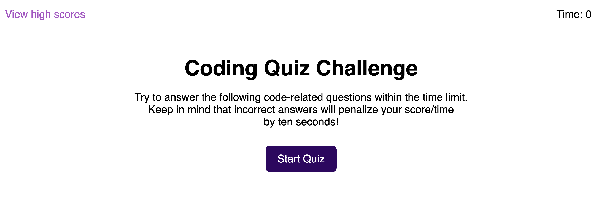
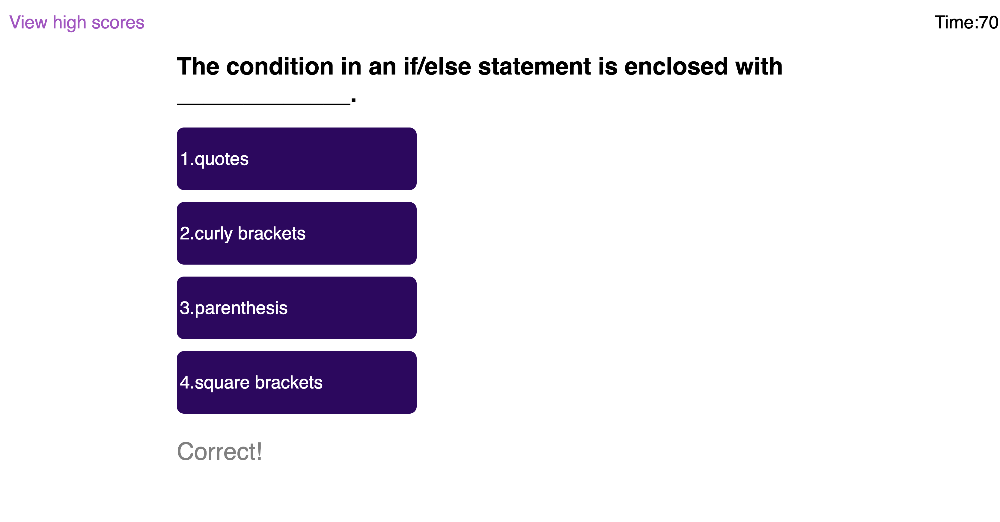
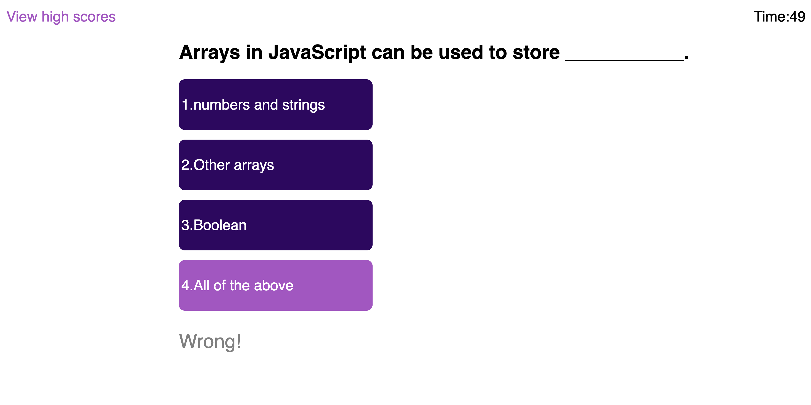
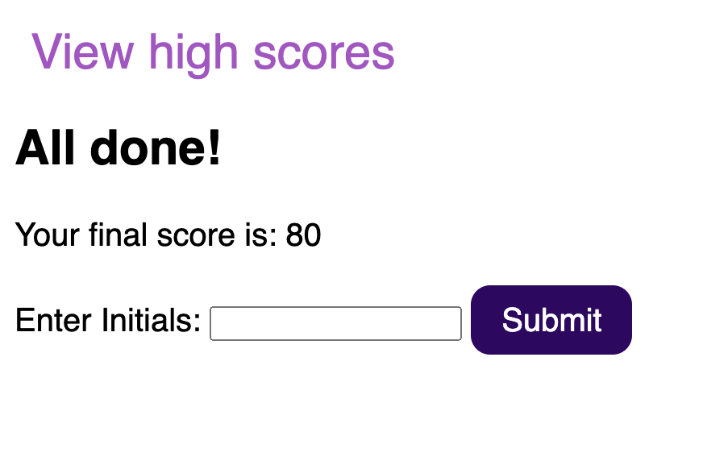
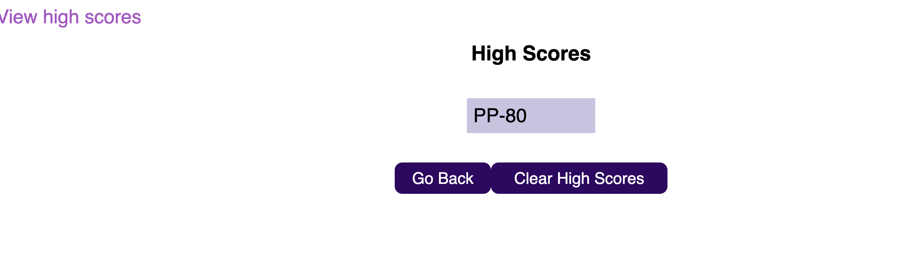

# Challenge 4 Timed Javascript Fundamentals Code Quiz
Using WEB APIs, Javascript, HTML and CSS, a timed coding quiz will be created. It will contain multiple choiced questions on Javascript fundamentals and a clean, polished, and responsive user interface. High scores along with user initial will be stored.
Link to Application:(https://pppreap.github.io/challenge4_timedcodingquiz/)

# User Story
AS A coding boot camp student,
I WANT to take a **timed quiz on JavaScript fundamentals that stores high scores**
SO THAT I can gauge my progress compared to my peers.

## Acceptance Criteria
Coding Quiz Criteria below:

WHEN the **start button is clicked**,
**a timer starts** and a question is presented.

WHEN a question is answered,
THEN **another question is presented**.

WHEN a question is **answered incorrectly**,
THEN **time is subtracted** from the clock.

WHEN **all questions are answered or the timer reaches 0**,
THEN the game is over.

WHEN the game is over,
THEN I **can save my initials and score.**

### Assets
These images shows the **visuals of the coding quiz**, example of questions, correct answer, wrong answer, and scores and initial log.

#### Links
[Github Repository Link](https://github.com/pppreap/challenge4_timedcodingquiz)
///
[Link to Coding Quiz](https://pppreap.github.io/challenge4_timedcodingquiz/)

#### Credits
Assignment  User Story and Criteria from Module 4, Michigan State University Coding Bootcamp 2022.
